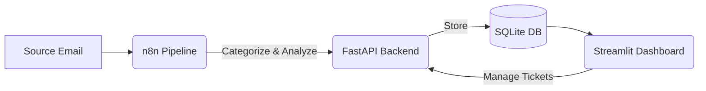

# Support Email Intelligence (Mail Scrapper)

A premium, AI-powered system designed to streamline support ticket management. This project automates the fetching, categorization, and analysis of support emails, providing a sleek dashboard for efficient resolution.

## Overview

The **Support Email Intelligence** system consists of three main components working in harmony:
1.  **n8n Pipeline**: Fetches emails, performs AI-driven sentiment analysis, categorization, and generates suggested replies.
2.  **FastAPI Backend**: A robust REST API that stores processed email data and manages ticket lifecycles.
3.  **Streamlit Dashboard**: A high-performance, interactive UI for support agents to manage tickets, view analytics, and refine AI-suggested replies.

---

## Architecture



---

## n8n Pipeline

The core automation is handled by an n8n workflow. It is responsible for:
- Monitoring an inbox for new support emails.
- Using LLMs to determine **Category**, **Priority**, and **Sentiment**.
- Generating a **Suggested Reply** based on the email content.
- Sending the structured data to the backend API.

### Pipeline Files
You can find the pipeline assets in the `backend/` directory:
- **Workflow JSON**: [`MailScrapper.json`](./backend/MailScrapper.json) (Import this into your n8n instance)
- **Workflow Preview**: [`n8n workflow.png`](./backend/n8n workflow.png)


---

## Getting Started

### 1. Backend Setup (FastAPI)
```bash
# Install dependencies
pip install -r requirements.txt

# Run the backend (listening on port 8000)
python backend/main.py
```

### 2. Dashboard Setup (Streamlit)
```bash
# Run the dashboard
streamlit run dashboard/app.py
```

### 3. n8n Pipeline Setup
1. Open your n8n workspace.
2. Click on **Workflow** > **Import from File**.
3. Select `backend/MailScrapper.json`.
4. Configure your Email credentials and API endpoints (pointing to your FastAPI server).

---

## Features

- **Automated Triage**: Automatically tag emails as Billing, Technical, General, etc.
- **Priority Detection**: Identify urgent issues instantly.
- **Sentiment Tracking**: Understand user frustration levels at a glance.
- **Interactive Dashboards**: Filter tickets by status and priority with real-time analytics.
- **AI-Assisted Replies**: Save time with pre-generated, editable responses.

---

## Project Structure

```text
Mail_Scrapper/
├── backend/
│   ├── main.py              # FastAPI Application
│   ├── database.py          # SQLite database logic
│   ├── MailScrapper.json    # n8n Pipeline JSON
│   └── n8n workflow.png     # n8n Workflow Preview
├── dashboard/
│   └── app.py               # Streamlit Dashboard
├── requirements.txt         # Project dependencies
└── seed_data.py             # Script to populate initial data
```

---

*Built for efficient support.*
